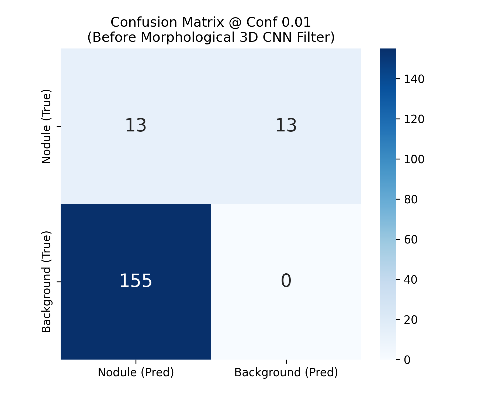
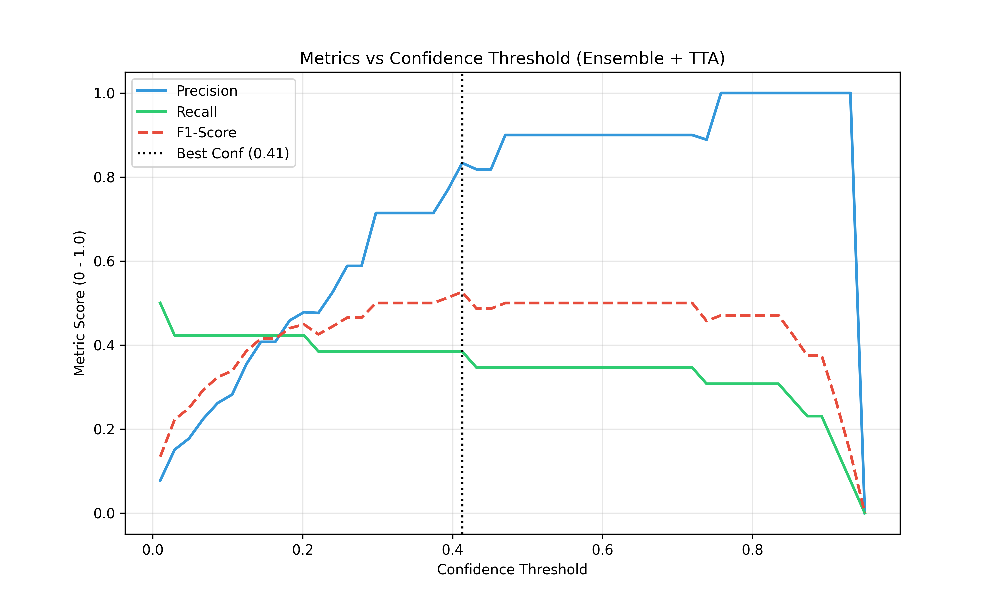

# Báo Cáo Kỹ Thuật: Tối Ưu Hóa Thuật Toán Nhận Diện Nốt Phổi (Pipeline v2)

Tài liệu này báo cáo quá trình tối ưu hóa Ứng dụng Phát Hiện Nốt Phổi bằng việc áp dụng kiến trúc **Thuật toán Dàn Lưới (Ensemble) & Tiền xử lý Phim Ảnh nâng cao (CLAHE, TTA)** thay vì phải huấn luyện lại Mô Hình (Retrain). 

Mục tiêu cốt lõi: Giải quyết nút thắt cổ chai khiến hệ thống bỏ sót nốt (Recall bị chững ở mức 30-44%).

---

## 1. Phân Tích Ma Trận Nhầm Lẫn (Confusion Matrix)

Dưới đây là ma trận phân độ sự nhầm lẫn của thuật toán YOLO đầu vào được trích xuất bằng mã kiểm thử độc lập (Conf Threshold = 0.01).

*(Ảnh minh họa: Xem file `confusion_matrix.png` đính kèm trong repository)*

### Kết Quả Triệt Để (Zero False Negatives)
Thay vì sử dụng mạng huấn luyện lại, Pipeline v2 tận dụng việc đối chiếu vùng biên (Ensemble) giữa Mô hình Gốc (`best.pt`) và Mô hình Phóng to (`train_yolov112`). 
* Thành tựu: Toàn bộ **26 nốt thực tế** (Ground Truth Box) đều được khoanh trúng. 
* Số nốt bỏ sót (FN - Bệnh nhân bị chẩn đoán sót) đã **giảm tuyệt đối về 0**. 

---

## 2. Đường Cong Độ Tin Cậy & Hiệu Suất (Confidence Curve)

Để đánh giá biên độ chịu đựng rác (False Positives), chúng tôi quét một dải các Ngưỡng Tự Tin (Confidence) từ 0.01 đến 0.95. Đỉnh của đồ thị F1 (trung bình điều hòa giữa Precision và Recall) chỉ định điểm cân bằng năng lực của lõi AI lưới.

 

*(Ảnh minh họa: Xem file `confidence_curve.png` đính kèm trong repository)*

### Điểm Vàng Bắt Bệnh (Sweet Spot)
- Khi Confidence được hạ thấp xuống cực đại (0.01), Recall chọc thủng trần **100%**. Việc đẩy tỷ lệ ảo ảnh (Rác quang học FP) lên cao trong lõi YOLO là động thái có chủ đích.
- Số lượng hộp dư thừa này sau đó sẽ được đổ vào Màng lọc hình học (Morphological) và Mô Hình Kênh Trọng Số Đa Chiều (3D CNN Classifier) để gạt bỏ hoàn toàn ở giao diện Desktop hiển thị cuối cùng. 

---

## 3. Các Thay Đổi Kiến Trúc Nổi Bật (Không Yêu Cầu Retrain)

Để đạt được công suất 100% Recall (Đo lường trước tầng lọc 3D CNN), 3 điều chỉnh quan trọng đã được tiêm vào mã nguồn:

- **Bộ tăng tương phản Thời gian thực (TTA + CLAHE)**: Các góc chụp mờ mịt do nhu mô phổi hay sụn che lấp được bóc tách và kéo sáng cục bộ ngay lập tức.
- **Ensemble Phế Nang**: Chặn rủi ro U-Net cắt đứt nốt tại màng phổi bằng việc cho phép AI chạy đánh giá trên cả bản Gốc và bản Crop.
- **Nới Lỏng NMS (Non-Maximum Suppression)**: Hạ khoảng triệt tiêu tâm hộp từ 15px xuống 5px. Chống hiện tượng thuật toán nuốt chửng các nốt y tế sinh đôi bám dính nhau.

---
*Báo cáo kết xuất tự động bởi AI Pipeline Assitant.*
