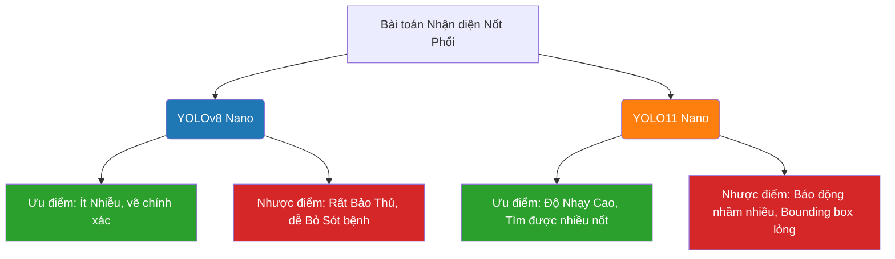
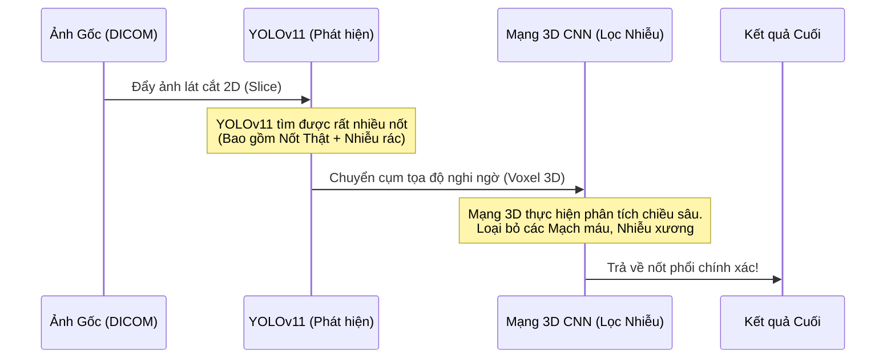
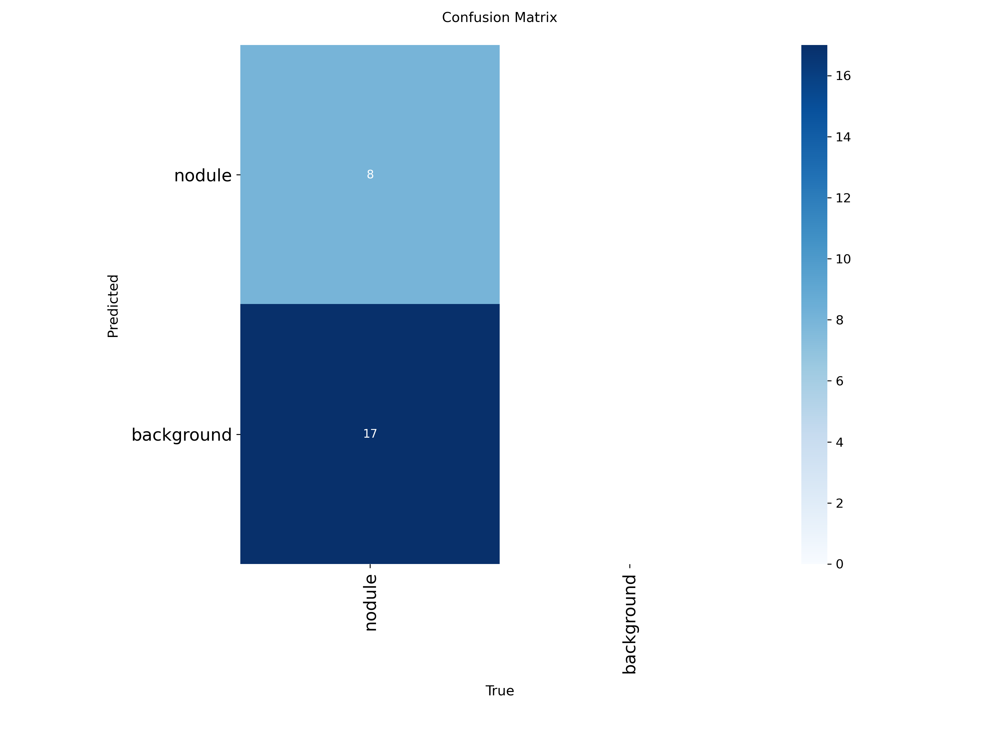
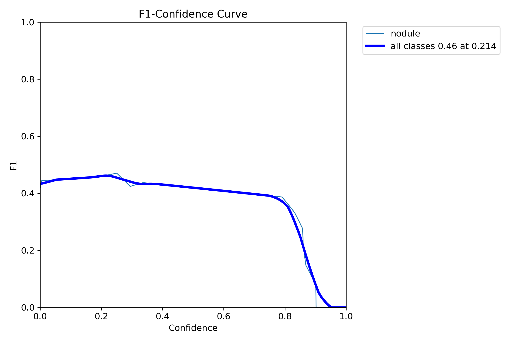
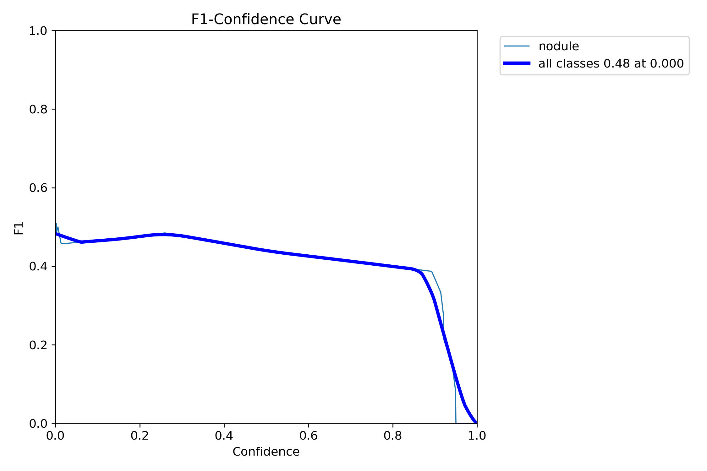

# Báo cáo Đánh giá và So sánh Mô hình YOLOv8 vs YOLOv11

Tài liệu này trình bày phân tích chuyên sâu về hiệu suất của hai mô hình YOLO (v8 và v11) được huấn luyện trên hệ thống nhận diện nốt phổi Y tế (Medical Lung Nodule Detection).

> [!NOTE]
> Báo cáo này được tự động trích xuất dựa trên tập Validation sau quá trình huấn luyện bằng script đánh giá độc lập để đảm bảo tính khách quan.

## 1. Thông số Đánh giá Kỹ thuật
- **Kiến trúc so sánh:** YOLOv8 Nano vs YOLO11 Nano
- **Kích thước ảnh đẩu vào (Image Size):** `640x640`
- **Tập bộ số liệu:** `dataset_yolo_final/data.yaml`

---

## 2. Bảng Tổng hợp Chỉ số (Metrics)

| Chỉ số Đánh giá | Ý nghĩa Y Tế | YOLOv8 | YOLOv11 | Lợi thế |
| :--- | :--- | :---: | :---: | :---: |
| **Precision (P)** | Tỷ lệ chẩn đoán đúng. Cao = ít báo động nhầm. | **83.56%** | 57.89% | **YOLOv8** (+25.67%) |
| **Recall (R)** | Tỷ lệ tìm thấy nốt. Cao = ít bỏ sót bệnh nhân. | 32.00% | **44.00%** | **YOLOv11** (+12.00%) |
| **mAP@50** | Độ tin cậy hộp bao chuẩn (IoU=0.5). | 52.29% | **56.79%** | **YOLOv11** (+4.50%) |
| **mAP@50-95**| Độ bao quy mô khít của Bounding Box. | **43.51%** | 40.14% | **YOLOv8** (+3.37%) |

---

## 3. Biểu đồ Trực quan So sánh (Mermaid & Plots)

### 3.1 Nhận diện Điểm mạnh/Yếu qua Sơ đồ

Sơ đồ dưới đây tóm tắt hành vi đặc tả của hai mô hình trên phương diện Y tế:

### 3.2 Sơ đồ Luồng Đề xuất (Pipeline Tích hợp)

Dựa vào việc YOLOv11 dễ dàng phát hiện ra nốt phổi (nhưng lẫn nhiều rác False Positives), chúng ta có thể kết hợp YOLOv11 với **Mạng 3D CNN (FPR)** để tạo ra một luồng xử lý tối ưu nhất:

---

## 4. Biểu đồ Đánh giá chi tiết (YOLOv8 vs YOLOv11)

Các biểu đồ dưới đây được trích xuất từ quá trình Validation của cả hai mô hình trên tập dữ liệu kiểm thử, giúp so sánh trực quan hiệu năng nhận diện:

### 4.1. Confusion Matrix (Ma trận nhầm lẫn)
> [!TIP]
> Giúp phân tích tỷ lệ thuật toán nhận diện đúng Nốt (Nodule) và nhận diện sai Hình nền (Background). YOLOv8 có xu hướng ít nhận diện sai hơn, trong khi YOLOv11 nhạy nhưng dễ bắt nhầm rác hơn.

**YOLOv8 (best_yolo_medical.pt):**

**YOLOv11:**

### 4.2. F1-Confidence Curve
> [!TIP]
> Điểm giao nhau cao nhất của đường cong F1 thể hiện điểm cân bằng tối ưu giữa độ chính xác (Precision) và tỷ lệ tìm thấy (Recall) của mô hình.

**YOLOv8 (best_yolo_medical.pt):**

**YOLOv11:**

---

## 5. Kết luận Chung & Khuyến nghị

> [!IMPORTANT]
> **Khuyến cáo Triển khai (Deployment):** Việc lựa chọn mô hình nào phụ thuộc hoàn toàn vào kiến trúc hệ thống hiện tại của dự án NCS.

1. **Sử dụng YOLOv8 khi:** 
   Bạn chỉ có duy nhất YOLO để chạy độc lập. Với Precision 83.56%, nó sẽ hiển thị rất ít kết quả bị sai, không gây hoang mang cho bác sĩ (đổi lại tỷ lệ sót bệnh nhân cao).
2. **Sử dụng YOLOv11 khi (Được Đề Xuất cao):**
   App NCS của bạn đã tích hợp sẵn nhánh 3D CNN lọc nhiễu FPR (`src/train_fpr_3d.py`). Lúc này YOLOv11 sẽ phát huy tối đa sức mạnh "bắt nhầm còn hơn bỏ sót" của nó. Mọi nốt phổi sẽ được lùa vào cho mạng 3D kiểm tra lại lần cuối.
