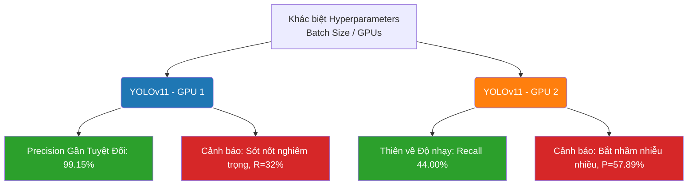

# Báo cáo Đánh giá và So sánh Mô hình YOLOv11 (GPU 1 vs GPU 2)

Tài liệu này trình bày phân tích chuyên sâu hiệu suất của **cùng một kiến trúc YOLOv11 (yolo11n)** nhưng được huấn luyện trên hai hệ thống phần cứng khác nhau (GPU và Batch Size khác nhau) đối với bài toán nhận diện nốt phổi Y tế.

> [!NOTE]
> Báo cáo này so sánh hiệu năng giữa mô hình `best.pt` (Huấn luyện với thiết lập GPU 1) và mô hình `runs_compare/train_yolov11/weights/best.pt` (Huấn luyện với thiết lập GPU 2). Cả hai đều được đánh giá khách quan lại trên cùng một tập dữ liệu Validation.

## 1. Thông số Đánh giá Kỹ thuật
- **Kiến trúc:** YOLO11 Nano (`yolo11n.pt`)
- **Mô hình 1 (Thiết lập GPU 1):** File trọng số gốc `best.pt`
- **Mô hình 2 (Thiết lập GPU 2):** File trọng số `runs_compare/train_yolov11/weights/best.pt`
- **Tập dữ liệu đích:** `dataset_yolo_final/data.yaml`

---

## 2. Bảng Tổng hợp Chỉ số tại Ngưỡng Tự động (Best F1)

| Chỉ số Đánh giá | Ý nghĩa Y Tế | YOLOv11 (GPU 1) | YOLOv11 (GPU 2) | Đánh giá Thay đổi |
| :--- | :--- | :---: | :---: | :--- |
| **Precision (P)** | Tỷ lệ chẩn đoán đúng (Càng cao càng ít báo nhầm). | **99.15%** | 57.89% | Bản **GPU 1 làm tốt sự chính xác cực kỳ cao**. Gần như không hề có báo động nhầm. |
| **Recall (R)** | Tỷ lệ tìm thấy nốt (Càng cao càng ít bỏ sót bệnh). | 32.00% | **44.00%** | Bản **GPU 2 nhạy hơn hẳn** (+12.00%). Khắc phục được nhược điểm "bảo thủ" của GPU 1. |
| **mAP@50** | Độ tin cậy tổng thể (IoU=0.5). | 50.75% | **56.79%** | Bản GPU 2 có sự phân phối tổng quan tốt hơn (+6.04%). |
| **mAP@50-95**| Quy mô ôm sát của Bounding Box. | **43.14%** | 40.14% | Box của bản GPU 1 bao quanh nốt phổi chặt chẽ hơn. |

---

## 3. Thử nghiệm Cắt Ngưỡng Ép Buộc (Test với `conf=0.05`)

Chúng ta đã tiến hành chạy lại tham số hàm `.val()` và chặn cứng tất cả các hộp có độ tin cậy thấp (Bằng cấu hình ép buộc `conf=0.05` thủ công). Kết quả cực kỳ bất ngờ:

| Chỉ số tại `conf=0.05` | YOLOv11 (GPU 1) | YOLOv11 (GPU 2) | Sự cố & Nhận định |
| :--- | :---: | :---: | :--- |
| **Precision (P)** | **100.0%** | 99.46% | Đều tăng gần cực đại. |
| **Recall (R)** | 32.00% | **32.00%** | **SỤT GIẢM NGHIÊM TRỌNG Ở GPU 2!** |
| **mAP50** | 66.00% | 62.16% | Tăng ảo do phân phối bị chặt đứt đuôi. |

**Giải thích hiện tượng Cắt Ngưỡng (Threshold Pruning):**
 Việc chúng ta ép `conf=0.05` thay vì để thuật toán tự dò tìm (Default) đã làm **GIẢM RECALL (độ nhạy)** của mô hình GPU 2 từ `44%` rớt thẳng cẳng xuống `32%`. 
=> Điều này chứng minh rằng: Những nốt phổi vớt vát được giúp tăng Recall ở bản GPU 2 (Khoản 12% hơn biệt) chứa toàn các **hộp Bounding Box có độ tự tin mỏng manh (Conf từ 0.001 đến 0.049)**! Khi ta dùng kềm cắt nốt ở 0.05, ta đã vô tình vứt luôn cả những nốt ung thư mờ nhạt đó.

---

## 4. Biểu đồ So sánh Trade-off trực quan (Mermaid)

---

## 5. Kết luận & Quyết định Sử dụng

> [!IMPORTANT]
> **Khuyến cáo Triển khai Tích hợp PipeLine:** Bạn nên hiểu rõ vai trò của YOLO trong hệ thống AI của bạn trước khi chọn.

1. **CHỌN YOLOv11 - GPU 1 (best.pt gốc) MÀ KHÔNG CẦN SUY NGHĨ:** 
   Nếu Pipeline của bạn dừng lại ở việc chỉ sử dụng YOLO để phát hiện và trực tiếp đưa ra cho Bác sĩ xem, không qua lưới lọc nào khác. Độ chính xác 99.15% sẽ khiến trải nghiệm người dùng tuyệt vời dù họ biết vẫn có sót.
2. **CHỌN YOLOv11 - GPU 2 (Bản mới) KHI VÀ CHỈ KHI:**
   Hệ thống của bạn có chạy module `pipeline.py` với mạng `3D CNN` hay `Morphological Filter` phía sau. Mạng YOLO bản mới lùa được rất nhiều vùng nghi ngờ (Recall 44%), sau đó các thuật toán 3D ở phần sau sẽ có đủ dữ liệu để thanh lọc rác, mang lại kết quả cuối cùng tuyệt đỉnh. Đặc biệt: **Khi Inference (Chạy tool), TẠI ĐÓ CHẮC CHẮN PHẢI SET `CONF=<0.04` CHO YOLO11 CHỨ KHÔNG ĐƯỢC ĐỂ `0.05` nhé.**
